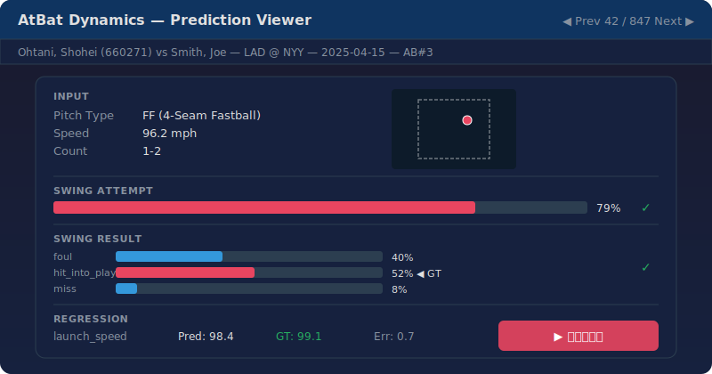

# atbat-dynamics-model

Statcast のデータを用いて未来の打席結果を予測する AI (Deep Neural Network, DNN) モデルを構築してみた。

## 目次

- [デモ](#デモ)
- [概要](#概要)
- [プロジェクト構成](#プロジェクト構成)
- [必要条件](#必要条件)
- [セットアップ](#セットアップ)
- [設定](#設定)
- [学習](#学習)
- [テスト・性能評価](#テスト性能評価)
- [データセット](#データセット)
- [モデル](#モデル)
- [モデルグラフの可視化](#モデルグラフの可視化)
- [予測結果の可視化（Prediction Viewer）](#予測結果の可視化prediction-viewer)

## デモ

構築した DNN モデルを用いて2025シーズンの大谷の全打席結果を予測してみた。

<a href="https://carside71.github.io/atbat-dynamics-model/viewer_ohtani.html">
  
</a>

**[▶ ライブデモを開く](https://carside71.github.io/atbat-dynamics-model/viewer_ohtani.html)**

---

## 概要

投球情報（球種・球速・変化量・コース・投球軌道）と打席状況（打者・カウント・走者/アウト状況・イニング・点差）を入力として、以下の4つを同時に予測します。

| ヘッド | 出力 | タスク |
|---|---|---|
| swing_attempt | スイングしたか | 二値分類 |
| swing_result | スイング結果（foul, hit_into_play, miss） | 3クラス分類 |
| bb_type | 打球種別（ground_ball, fly_ball, line_drive, popup） | 4クラス分類 |
| regression | launch_speed, launch_angle, hit_distance_sc, spray_angle | 回帰 |

階層的マスク付き損失を使い、スイングしなかった場合の swing_result や、インプレーにならなかった場合の bb_type / 回帰ターゲットは損失計算から除外されます。

### 物理的整合性損失（Physics Consistency Loss）

分類予測と回帰予測を独立に学習すると、「ゴロ（ground_ball）と予測しているのに打出角（launch_angle）がフライの値」といった物理的に矛盾した出力が発生し得ます。`PhysicsConsistencyLoss` はこの問題に対処する補助損失で、以下の物理制約をソフトペナルティとして課します。

| 制約 | 分類ヘッド | 回帰ターゲット | 物理的定義（Statcast 基準） |
|---|---|---|---|
| 打球タイプ × 打出角 | bb_type | launch_angle | GB: < 10°, LD: 10°〜25°, FB: 25°〜50°, PU: > 50° |
| スイング結果 × 打球方向 | swing_result | spray_angle | hit_into_play: フェア内 (±45°), foul: フェア外 |

- 分類ロジットの **softmax 確率** で重み付けし、`torch.relu` ベースの微分可能ペナルティを計算するため、分類・回帰の両ヘッドに勾配が伝播します
- MDN（Mixture Density Network）ヘッドにも対応: 混合分布の期待値 E[y] = Σ π_k * μ_k を使用
- `loss_weight_physics: 0.0`（デフォルト）で無効、`0.001`〜`0.01` 程度で有効化を推奨

### モデルスコープ（model_scope）

`model_scope` 設定により、予測タスクの範囲を切り替えて **分離学習** が可能です。

| `model_scope` | 予測対象 | 学習データ | 用途 |
|---|---|---|---|
| `all`（デフォルト） | 全4タスク | 全サンプル | 統合モデル（従来動作） |
| `swing_attempt` | swing_attempt のみ | 全サンプル | スイング判定の専用モデル |
| `outcome` | swing_result + bb_type + regression | swing_attempt=1 のみ | スイング後の結果予測専用モデル |

`swing_attempt` モデルと `outcome` モデルを別々に学習することで、各タスクに最適化された専用モデルを構築できます。

## プロジェクト構成

```
atbat-dynamics-model/
├── configs/                     # YAML 設定ファイル
│   ├── dnn.yaml
│   ├── dnn_change_loss_w.yaml
│   ├── dnn_mdn.yaml
│   ├── resdnn.yaml
│   ├── resdnn_swing_attempt.yaml
│   ├── resdnn_outcome.yaml
│   ├── resdnn_cascade.yaml
│   ├── resdnn_cascade_physics.yaml
│   ├── resdnn_focal.yaml
│   ├── seq_resdnn.yaml
│   ├── seq_resdnn_batter_hist.yaml
│   └── seq_resdnn_mdn_cascade_batter_hist.yaml
├── docs/                        # GitHub Pages デモサイト
│   ├── index.html               #   リダイレクトページ
│   └── viewer_ohtani.html       #   Prediction Viewer デモ
├── figs/                        # ドキュメント用画像
│   ├── viewer_ohtani.html       #   ビューア HTML（オリジナル）
│   └── viewer_preview.svg       #   README 用プレビュー画像
├── src/
│   ├── config.py                # 設定定義 & YAML 読み込み
│   ├── train.py                 # 学習スクリプト
│   ├── test.py                  # テスト・性能評価スクリプト
│   ├── datasets/                # データセット & 前処理
│   │   ├── README.md
│   │   ├── loaders.py           #   データ読み込みユーティリティ
│   │   ├── statcast.py          #   StatcastDataset（単一投球）
│   │   ├── statcast_sequence.py #   StatcastSequenceDataset（系列対応）
│   │   └── statcast_batter_hist.py # StatcastBatterHistDataset（打者履歴対応）
│   ├── losses/                  # 損失関数
│   │   ├── focal.py             #   Focal Loss
│   │   ├── multi_task.py        #   マルチタスク損失 & MDN 損失
│   │   └── physics.py           #   物理的整合性損失（PhysicsConsistencyLoss）
│   ├── models/                  # モデルアーキテクチャ
│   │   ├── README.md
│   │   ├── atbat_dnn.py         #   基本マルチヘッド DNN
│   │   ├── atbat_dnn_mdn.py     #   DNN + MDN 回帰ヘッド
│   │   ├── atbat_resdnn.py      #   残差接続 + GELU
│   │   ├── atbat_resdnn_cascade.py  # カスケードヘッド付き
│   │   ├── atbat_seq_resdnn.py  #   系列エンコーダ + ResBlock
│   │   └── atbat_seq_resdnn_batter_hist.py # 打者履歴エンコーダ付き
│   └── utils/
│       ├── graph_export.py      # モデルグラフ可視化
│       ├── logging.py           # ログ出力
│       └── model_io.py          # モデル構築・保存・復元
├── tests/
│   ├── conftest.py              # テスト用共通 fixture
│   ├── test_model_scope.py      # model_scope 関連テスト
│   └── test_physics_loss.py     # PhysicsConsistencyLoss テスト
├── notes/                       # データ構築・分析ノートブック
│   ├── 00_build_dataset/        #   前処理パイプライン
│   │   └── build_dataset.ipynb  #     データセット構築ノートブック
│   ├── 01_analysis/             #   データ分析
│   └── locals/                  #   ローカル実行用スクリプト
├── scripts/
│   ├── export_model_graph.py    # モデルグラフ構造の画像出力
│   ├── run_container_mac.sh     # Mac 用コンテナ起動
│   └── run_container_wsl.sh     # WSL 用コンテナ起動
├── tools/
│   ├── build_dataset/           # データセット構築パイプライン
│   │   ├── columns.py           #   カラム名定数・マッピング定義
│   │   ├── step_filter.py       #   Step 1: 打者フィルタ
│   │   ├── step_features.py     #   Step 2: 特徴量エンジニアリング
│   │   ├── step_labels.py       #   Step 3: ラベル生成・エンコーディング
│   │   ├── step_splits.py       #   Step 4: 分割・打者履歴・保存
│   │   ├── step_validate.py     #   Step 5: データ品質レポート
│   │   └── pipeline.py          #   パイプラインオーケストレータ
│   ├── build_metadata.py        # ビューア用選手名メタデータ構築
│   ├── generate_viewer.py       # 予測ビューア HTML 生成 CLI
│   ├── viewer_builder.py        # データ変換・HTML 組み立て
│   └── viewer_template.html     # ビューア HTML テンプレート
├── Dockerfile
├── pyproject.toml
└── requirements.txt
```

## 必要条件

- Python 3.10+
- PyTorch 2.x（CUDA 対応推奨）
- 主な依存: `numpy`, `pandas`, `pyyaml`, `tqdm`, `scikit-learn`

## セットアップ

### ローカル環境

```bash
python3 -m venv .venv
source .venv/bin/activate
pip install --upgrade pip
pip install -r requirements.txt
```

### Docker

```bash
docker build -t atbat-dynamics-model-image:latest .
./scripts/run_container_wsl.sh   # WSL の場合
./scripts/run_container_mac.sh   # Mac の場合
```

スクリプト内の `SRC_DIR`, `DATA_DIR`, `OUT_DIR` を環境に合わせて編集してください。

## 設定

YAML ファイル（`configs/` ディレクトリ）で `data`, `model`, `train` の3セクションを設定できます。
各フィールドは省略可能で、省略時はデフォルト値が使われます。

```yaml
data:
  dataset_dir: /workspace/datasets/statcast-customized-v2

model:
  model_scope: all               # "all" | "swing_attempt" | "outcome"
  backbone_type: resdnn           # "dnn" | "resdnn"
  backbone_hidden: [512, 512, 256, 256, 128]
  head_hidden: [64]
  dropout: 0.2

train:
  batch_size: 4096
  num_epochs: 30
  lr: 1.0e-3
  device: cuda
  focal_gamma: 0.0       # > 0 で Focal Loss 有効
  use_class_weight: false # true でクラス頻度の逆数重み付け
  label_smoothing: 0.0   # > 0 で Label Smoothing 有効（0.1 程度が一般的）
  loss_weight_physics: 0.0      # > 0 で物理的整合性損失を有効化（0.001〜0.01 推奨）
  physics_margin_degrees: 2.0   # 境界付近のマージン（度）
```

設定可能な全フィールドは `src/config.py` および `configs/` 内の各 YAML ファイルを参照してください。

## 学習

```bash
# YAML 設定ファイルを指定して実行（全タスク統合モデル）
python3 src/train.py --config configs/resdnn.yaml

# swing_attempt 専用モデルの学習
python3 src/train.py --config configs/resdnn_swing_attempt.yaml

# outcome 専用モデルの学習（swing_attempt=1 のサンプルのみ使用）
python3 src/train.py --config configs/resdnn_outcome.yaml

# デフォルト設定で実行（YAML 不要）
python3 src/train.py
```

学習が完了すると、`output_dir`（デフォルト: `/workspace/outputs/atbat-dynamics-model/`）に以下が保存されます。

| ファイル | 内容 |
|---|---|
| `best_model.pt` | 検証損失が最小のモデル重み |
| `final_model.pt` | 最終エポックのモデル重み |
| `history.json` | エポックごとの損失・精度の履歴 |
| `norm_params.json` | 入力・ターゲットの正規化パラメータ |
| `model_config.json` | モデル構造の設定 |

## テスト・性能評価

学習済みモデルの性能をテストデータまたは検証データで評価できます。

```bash
# テストデータで評価
python3 src/test.py --config configs/resdnn.yaml --split test

# 検証データで評価
python3 src/test.py --config configs/resdnn.yaml --split val

# モデルディレクトリ・ファイルを明示的に指定
python3 src/test.py --model-dir /path/to/model --model-file best_model.pt
```

評価されるメトリクス:

| タスク | メトリクス |
|---|---|
| swing_attempt | Accuracy, F1, ROC AUC, Confusion Matrix |
| swing_result | Accuracy, F1 (macro/weighted), Per-class Report |
| bb_type | Accuracy, F1 (macro/weighted), Per-class Report |
| regression | MAE, RMSE, R²（元スケールに逆変換） |

結果はコンソールに表示されるほか、`test_results_test.json` / `test_results_val.json` としてモデルディレクトリに保存されます。

### 予測値の保存

`--save-predictions` フラグを付けると、サンプルごとの予測値・GT・入力特徴量を NPZ + メタデータ JSON として保存します。後述の [Prediction Viewer](#予測結果の可視化prediction-viewer) で可視化に使用します。

```bash
python3 src/test.py --config configs/resdnn.yaml --save-predictions
```

| ファイル | 内容 |
|---|---|
| `predictions_{split}.npz` | 予測確率・logits・GT・入力特徴量（NumPy 圧縮アーカイブ） |
| `predictions_meta_{split}.json` | ラベル名・正規化パラメータ・カテゴリラベルマッピング |

## データセット

`/workspace/datasets/statcast-customized-v2/` にフラット構造で配置されたデータセットを使用します。

| ファイル | 内容 |
|---|---|
| `pitches.parquet` | 全投球データ（単一ファイル） |
| `stats_*.csv` | カテゴリカル特徴量のラベル対応テーブル |
| `train_at_bat_ids.csv` / `valid_at_bat_ids.csv` / `test_at_bat_ids.csv` | 時系列分割の `at_bat_id` リスト |
| `batter_game_history.parquet` / `atbat_row_indices.parquet` | 打者履歴ルックアップテーブル |
| `atbat_metadata.parquet` / `player_names.json` | ビューア用メタデータ |

データ分割は **時系列分割**（`game_date` ベース）で行われます。学習データは 2024-06-30 以前、検証データは 2024-07-01〜2024-10-30、テストデータは 2025-03-15 以降です。ダブルヘッダーを正しく区別するため `game_pk`（試合ごとに一意な ID）を使用します。

### データセット構築

`tools/build_dataset/` パッケージにモジュール化されたパイプラインで構築します。実行は `notes/00_build_dataset/build_dataset.ipynb` を開いて全セル実行するか、Python から直接呼び出します。

```python
from tools.build_dataset import run_pipeline
run_pipeline()
```

| Step | 内容 |
|------|------|
| 1. Filter | 2000球以上の打者を抽出 |
| 2. Features | カラム選択・ゲームステート・軌道特徴量・正規化 |
| 3. Labels | description解析・カテゴリカルエンコード・stats生成 |
| 4. Splits | 時系列分割・打者履歴構築・保存 |
| 5. Quality | ソースデータの品質レポート |

中間ファイルは生成せず、全処理をインメモリで実行します。各ステップの処理結果はノートブック上で視覚的に確認でき、実行後も見直せます。

データセットクラスや読み込みユーティリティの詳細は [src/datasets/README.md](src/datasets/README.md) を参照してください。

## モデル

すべてのモデルは **埋め込み → バックボーン → マルチヘッド** の3段構成で、レジストリパターンで管理されています。

| 設定ファイル例 | scope | 説明 |
|---|---|---|
| `dnn.yaml` | all | 基本マルチヘッド DNN (ReLU + BatchNorm) |
| `dnn_mdn.yaml` | all | 回帰ヘッドを MDN に置換 |
| `resdnn.yaml` | all | 残差接続 + GELU + LayerNorm |
| `resdnn_swing_attempt.yaml` | swing_attempt | ResBlock + swing_attempt 専用モデル |
| `resdnn_outcome.yaml` | outcome | ResBlock + outcome 専用モデル（SA=1 サンプルのみ） |
| `resdnn_cascade.yaml` | all | ResBlock + カスケードヘッド（ヘッド間情報伝達） |
| `resdnn_cascade_physics.yaml` | all | ResBlock + カスケード + 物理的整合性損失 |
| `resdnn_focal.yaml` | all | ResBlock + Focal Loss |
| `seq_resdnn.yaml` | all | 打席内系列エンコーダ (GRU/Transformer) + ResBlock |
| `seq_resdnn_batter_hist.yaml` | all | 上記 + 階層 GRU 打者履歴エンコーダ |

各モデルのアーキテクチャ詳細・図解・追加方法は [src/models/README.md](src/models/README.md) を参照してください。

## モデルグラフの可視化

登録済みモデルの計算グラフ構造を画像ファイル（PNG / PDF / SVG）として出力できます。

```bash
# 全モデルを一括出力
python3 scripts/export_model_graph.py --all

# YAML 設定ファイルから単一モデルを出力
python3 scripts/export_model_graph.py --config configs/resdnn.yaml

# アーキテクチャ名を直接指定
python3 scripts/export_model_graph.py --arch atbat_dnn_mdn
```

### オプション

| オプション | デフォルト | 説明 |
|---|---|---|
| `--config` | — | YAML 設定ファイルパス（排他） |
| `--arch` | — | アーキテクチャ名（排他） |
| `--all` | — | 全登録モデルを出力（排他） |
| `--output-dir` | `outputs/graphs` | 保存先ディレクトリ |
| `--format` | `png` | 出力形式（`png` / `pdf` / `svg`） |
| `--backend` | `torchview` | 描画バックエンド（`torchview` / `torchviz`） |
| `--depth` | `3` | モジュール展開深度（torchview のみ） |
| `--batch-size` | `2` | ダミー入力のバッチサイズ |

### バックエンド

- **torchview**（推奨）: モジュール階層を構造的に描画。`--depth` で展開の深さを制御可能
- **torchviz**: autograd の計算グラフを描画。各演算ノードが詳細に表示される

### 依存パッケージ

- Python: `torchview`, `torchviz`, `graphviz`（`requirements.txt` に記載済み）
- システム: `graphviz`（`apt-get install graphviz`、Dockerfile に記載済み）

## 予測結果の可視化（Prediction Viewer）

テスト結果をサンプル単位でインタラクティブに閲覧できる自己完結型 HTML ビューアを生成します。

### 前準備: 選手名メタデータの構築

ビューアで選手名を表示するには、事前に `player_names.json` を構築しておく必要があります。`atbat_metadata.parquet` はデータセット構築パイプライン（Step 4）で自動生成されます。**初回のみ実行すれば OK です**（データセットが変わらない限り再実行不要）。

```bash
python3 tools/build_metadata.py
```

処理内容:
1. `atbat_metadata.parquet` から打者・投手の MLBAM ID を収集
2. 元の Statcast CSV から投手名を収集
3. MLB Stats API から不足分の選手名を一括取得
4. `player_names.json` を出力

| オプション | デフォルト | 説明 |
|---|---|---|
| `--dataset-dir` | `/workspace/datasets/statcast-customized-v2` | データセットディレクトリ |
| `--raw-csv-dir` | `/workspace/datasets/statcast` | 元の Statcast CSV ディレクトリ（省略可） |

### 使い方

```bash
# 1. メタデータ構築（初回のみ）
python3 tools/build_metadata.py

# 2. テスト実行時に予測データを保存
python3 src/test.py --config configs/seq_resdnn_batter_hist.yaml --save-predictions

# 3. ビューア HTML を生成
python3 tools/generate_viewer.py \
  --pred-dir outputs/.../test/2026-03-20-120000 \
  --max-samples 3000

# 4. ブラウザで開く
# 生成された viewer.html をブラウザで開くだけで動作（外部依存なし）
```

#### 特定の打者だけのビューアを生成

`--batter` オプションで打者を指定すると、その打者の全データだけを含むビューアが生成されます。

```bash
# MLBAM ID で指定
python3 tools/generate_viewer.py \
  --pred-dir outputs/.../test/2026-03-20-120000 \
  --batter 660271

# 名前の一部で指定（部分一致検索）
python3 tools/generate_viewer.py \
  --pred-dir outputs/.../test/2026-03-20-120000 \
  --batter Ohtani
```

`--batter` 指定時は自動的に `filter=all`（全サンプル）、`max-samples=100000`（実質無制限）に調整されます。

### ビューア画面

1枚の "カード" に1サンプル（1投球）の全情報がまとまっています:

- **試合情報**: 打者名・投手名（MLBAM ID 付き）、対戦チーム、日付、Game ID、打席番号（メタデータ構築済みの場合）
- **入力情報**: 球種・投手投げ手・打席・カウント・走者/アウト状況・球速・回転数など
- **ストライクゾーン**: SVG で投球コースを描画（ゾーン内/外で色分け）
- **Swing Attempt**: 予測確率バー + GT との正誤
- **Swing Result**: 3クラス確率バー（foul / hit_into_play / miss）
- **BB Type**: 4クラス確率バー（ground_ball / fly_ball / line_drive / popup）
- **Regression**: launch_speed / launch_angle / hit_distance / spray_angle の予測値・GT・誤差

### 操作方法

| 操作 | 説明 |
|---|---|
| `←` / `→` キー | 前後のサンプルに移動 |
| `Home` / `End` | 先頭 / 最後に移動 |
| Prev / Next ボタン | クリックで前後移動 |
| サンプル番号入力 | 直接ジャンプ |
| フィルタドロップダウン | 全て / SA誤分類 / SR誤分類 / BT誤分類 / いずれか誤分類 |

### generate_viewer.py のオプション

| オプション | デフォルト | 説明 |
|---|---|---|
| `--pred-dir` | （必須） | `predictions_*.npz` と `predictions_meta_*.json` があるディレクトリ |
| `--split` | `test` | 評価スプリット（`test` / `val`） |
| `--max-samples` | `2000` | HTML に含める最大サンプル数 |
| `--filter` | `random` | サンプル選択フィルタ（`all` / `misclassified_sa` / `misclassified_sr` / `misclassified_bt` / `random` / `include_invalid`） |
| `--sort` | `index` | ソート基準（`index` / `sa_error` / `reg_error`） |
| `--output` | `pred-dir/viewer.html` | 出力 HTML ファイルパス |
| `--seed` | `42` | `random` フィルタ時のシード |
| `--metadata-dir` | `/workspace/datasets/statcast-customized-v2` | メタデータディレクトリ（試合情報・選手名表示用） |
| `--batter` | — | 特定の打者のみ表示（MLBAM ID または名前の一部） |

### データサイズの目安

| サンプル数 | HTML ファイルサイズ |
|---|---|
| 2,000 | 〜3 MB |
| 5,000 | 〜7 MB |
| 10,000 | 〜14 MB |

生成された HTML は CSS・JavaScript・データ全てを内包しており、ブラウザで開くだけで動作します。
